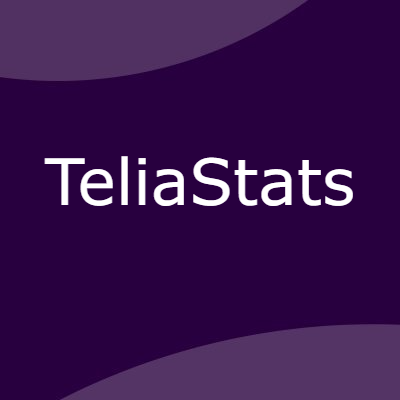

# Teliastats

Teliastats is a website that shows statistics for the Telialiagen League of Legends 2023 spring season. It shows statistics for the players and champions for all rounds of the season.

https://thundeee.github.io/TeliaStats/

## Description

Currently, there is no good way to view statistics for Telialiagen League of Legends. This website aims to fix that by showing statistics for the players and champions in all rounds of the season.
 
The data is fetched from Gamer.no. Teliastats also has a backend that fetches every club's players, all the games, and matches the game info to the correct player. When gathering the game data, Gamer.no only provides an ID of the player, not the name, so the backend has to match the ID to the correct player. After this, the backend stores the data in a Mongo.DB database and creates a JSON file that the frontend can fetch.

The frontend also fetches data from Gamer.no to get champion stats for each round, allowing the site to work in real-time without the need for the backend to be updated. However, the current version still requires manual updates to the backend for player stats and highscores.

Sometimes Gamer doesn't obtain the match data for a match or not for all the players. The reason for this is usually one of the following: A newly added player is in the game, the teams did not use the Tournament Code provided by Gamer.no, or someone changed their name on League of Legends. When any of these situations occur (and it happens a lot), Gamer doesn't care and simply sets the score for the round.

This means that my website would not be complete, and that's why when this happens, I input all the stats from the game manually so Teliastats will always have all the data. This is not an easy process since the games are not public, and I have to ask the players for the data. The current file for the missing data is currently closing in on 3000 lines of code.

### TLDR:
- Gamer.no has most of the data
- Backend fetches data from Gamer.no and stores it in a database
- Frontend fetches data from Gamer.no and the backend to show the data
- Site show statistics for players and champions for all rounds of the season
- Round stats are updated in real time
- Gamer.no sometimes dosent have all the data and I have to input it manually

## Built With

You can list a the tech stack that you've used over here

- [Node.js](https://nodejs.org/en/)
- [Bootstrap](https://getbootstrap.com)
- [Sass](https://sass-lang.com/)
- [MongoDB](https://www.mongodb.com/)
- [Github Pages](https://pages.github.com)

## Future plans

For the next season, Telialigaen is changing their name to Good Game-ligaen. For that I will make a new verison of teliastats hopefully with alot of improvements. I plan to make the site open source and allow people to contribute to the project.The most requested feature at the moment is being able to compare players head to head and rankings for each role. These are the top prioritiy features for the next season.

I also plan to have a chat with Gamer.no to see if they can provide me with data they get from the games. This would make the site be able to show more important stats like gold, cs, damage, and vision score.

## Getting Started

### Installing / Running

As this project is not open source yet, there are no instructions on how to install and run the project, the version for next season will be open source and will include these.

## Contributing

For the next season, I will be looking for contributors to help me with the project. If you are interested in contributing, please contact me on Discord or Twitter.

## Contact

The easiest way to get in touch with me is through Discord or Twitter. I am also available on other platforms, which you can find on my website.

## License

This project is licensed under the ISC License  

## Acknowledgments

My biggest thanks goes to the Norwegian League of Legends community for being very helpful and supportive of the project. A big thanks to everyone who shared the site with others and gave feedback, making this my biggest project yet.

Also a big thanks to:
- [Gamer.no](https://www.gamer.no/) for providing the data and hosting the league.

And to the people who helped me the most to hunt down game stats for the missing games:
- [Duzzskull](https://twitter.com/duzzskull)
- [BlazingFire](https://twitter.com/blazingfire_lol)
- [NicholaiRiis](https://twitter.com/nicholairiis)

